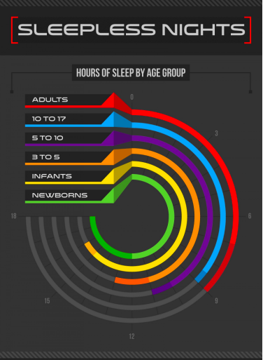
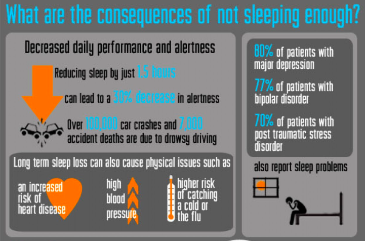

# Porject Report

__Topic: The Trend of Sleep Deprivation in United States and its effects on daily cognitive performance__

__Project Code Name: Sleep Deprivation__

__Group members:__
* Vivian Law (lawv@uw.edu)
* Phuong Vu (pvu@uw.edu)
* Yu-Wen Chen (yuwenwen511@gmail.com)
* Hanzhi Cao (hanzhc@uw.edu)

__Affiliation:__  
_Info-201: Technical Foundations of Informatics_  
_The Information School_  
_University of Washington_  
_Autumn 2019_

## 1.0 Introduction
### 1.1 Problem situation

_Requiremtns: Describe the general problem situation, by answering these and similar questions: What is the setting of the problem? Who are the direct and indirect stakeholders (see the Envisioning Cards). What values and tensions are in play for societies and individual people? What are the general issues at stake? What policy and ethical elements bear on the problem? What other work has been done in this area? How are building on this work? Why do you care about this problem and what motivates you to work on it? You employ the Envisioning Cards to address these and similar questions about the social implications and the ethical considerations of your work_

The stakeholders are adults. The setting of the problem is theUnited States. The values are people’s health and well-being. The tensions are tasks, deadlines, and culture affecting how students are sleeping. There are no policies regarding sleep for adults. There are only policies for safe sleep regarding infants. The ethic elements that exist are that deadlines are usually set at reasonable times so adults are not forced to wake up or stay up at an unreasonable time.

### 1.2 What is the problem?

_Requirement: Given the a description of the problem situation, what is the specific problem? Aim for a clear, concise, and interesting statement of the problem._

The main problem is adults not getting enough sleep every night, and it affects not only work performance but also both physical and mental health (Cunningham, 2019). The National Alliance on Mental Illness states that up to 44 percent of college students have reported themselves experiencing symptoms of depression, and 50 percent have suffered from anxiety, due to sleep deprivation caused by the overwhelming workload at college (“Mental Health Guide,” 2019).

### 1.3 What does it matter?

_Requirement: Why does the problem matter? Why is it important? Who cares about it?_

The problem of sleep deprivation matters because it influences physical and mental health, as well as their work and their relationships with others. Studies show that sleep deprivation in the long run impacts necessary skills that an adult needs to perform well such as memory recall or concentration, resulting in poor performance when working or doing assignments for school . Moreover, because of sleep deprivation’s impacts on their cognition, these students’ GPA do not correctly illustrate their understanding of the classes, making grading system less reliable to assess students’ understanding and knowledge-applying of the class. In addition, sleep deprivation can also contribute to mental disorders, such as insomnia, depression, and anxiety (Cunningham, 2019).

### 1.4 How it will be addressed?

_Requirement: In general, how will you address the problem? In general, what kinds of data wrangling and information visualizations will be used? In general, who is the audience for your work?_

Firstly, an ongoing trend of adults’ sleep deprivation will be dressed by using data in Sleep Deprivation. The proportion of samples among the population and the average hours of sleep should be calculated. Then by looking in a dataset about sleeping habits, we will figure out the reason why such pattern showed up and find out as many factors ranking from the most influential to the least. Since the real-world data is so complicated and the existence of feedback loops among factors is nothing to be sneezed at, more meta datasets are needed to address the correlation critically.

## 2.0 Research Questions
* What is the current trend of sleeping deprevation among adults?
* What are the major causes leading to this trend in U.S.?
* How does sleep deprivation in the U.S affect adults' work performance?

## 3.0 Possible data sets

_Requirement: You describe the original data set, answering such questions as: (1) Who created it? (2) Why was it reated?(3) Where did you access it? (4) What represents an “observation”? (5) What “variables” does each observation have? (6) How big is the data set? If it is a sub-set of a larger data set, how was the sub-set created? (7) If the data set represents people, who has been included and who has been excluded? You employ the envisioning cards to clarify the strengths and weaknesses of the data set(s). You describe the strengths and the weaknesses of the data set. Data wrangling. You discuss how you organized and cleaned your data. How did you reshape your data? How are missing values handled? You refer to the appendix: Data Dictionary. _

### Name: Life tracking project dataset

Description: Data from tracking daily activities over one month

[link](https://www.kaggle.com/maxschmidt94/life-tracking-project-dataset#life_total_data.csv)

### Name: Sleep Deprivation

Description: This dataset provides a wide variety of attributes for 90 participants. Some attributes include age group, BMI, education level, whether they have had depression, how long the participant’s sleep and types of sleep.

Link: https://www.kaggle.com/feraco/sleep-deprivation#demdata_160225_pseudonymized.csv

Number of Observations: 90

Number of Attributes: 100

Name: Sleep Study

Description: This dataset was collected from a survey-based study of US individuals’ sleeping habits. Phone use was one of the attributes to determine if phone use affects sleep. The survey also asked if the participants thought they got enough sleep.

Link: https://www.kaggle.com/mlomuscio/sleepstudypilot

Number of Observations: 104

Number of Attributes: 6

## 4.0 Information Visualizations

**Sleepless Nights**

Source: https://visual.ly/community/infographic/health/sleepless-nights

Figure 1: This data visualization is using color and shape to show how much sleep different age groups get. The main purpose for this data visualization is comparing and seeing who gets the most sleep and who gets the least sleep.

**The Facts on Sleeping Disorders**

Source: https://visual.ly/community/infographic/health/need-more-sleep-facts-sleeping-disorders

Figure 2: There are multiple elements to this data visualization. The percentages on the right show what effects of sleep deprivation affect the population. The color blue is used to make the percentage stand out. The left side shows the scary effects of car crashes and accident deaths that sleep deprivation can create.

## 5.0 Technical description of Shiny application

_Requirement: You describe how your Shiny application is built. You describe its major components and how they work. Key questions to answer: (1) How did you load your data (e.g., .csv file, API, etc.)? (2) What major libraries did you use? (3) How did you organize your code (directories and code files)? (4) What questions, if any, will you be answering with statistical analysis/machine learning?_

## 6.0 Conclusion

_Requirement: You should summarize: (1) The strengths and weaknesses of the project; (2) Themain lessons that you learned; and (3) The future work that you or someone elsemight pursue. _

## Acknowledgements

## References
[1] Cunningham, J. (2019). *College students aren’t getting nearly enough sleep.* Retrieved from http://sleepeducation.org/news/2019/07/18/college-students-are-not-getting-nearly-enough-sleep

[2] Feraco, F. (2018). *Sleep Deprivation.* Retrieved from https://www.kaggle.com/feraco/sleep-deprivation#demdata_160225_pseudonymized.csv

[3] Fusion360. (2014). *Sleepless Nights.* Retrieved from https://visual.ly/community/infographic/health/sleepless-nights

[4] Healthguru. (2012). *Need More Sleep? The Facts On Sleeping Disorders.* Retrieved from https://visual.ly/community/infographic/health/need-more-sleep-facts-sleeping-disorders

[5] Lomuscio, M. (2019). *Sleep Study.* Retrieved from https://www.kaggle.com/mlomuscio/sleepstudypilot

[6] Mental Health Guide for College Students. (2019). Retrieved from https://collegestats.org/resources/mental-health-guide/

## Appendix 1: Data Dictionary

_Requirement: In this appendix you should describe the variables that make up your data set, including: The name of the variable, a description of its meaning, the data type, and the measurement type._

## Appendix 2: Reflections 

_Requirement: In this appendix each team member should write a personal reflection on the project [> 150 words]. Topics might include: What you learned, what you found satisfying/frustrating, what you would do differently in the future, how the project positioned you develop your identity for coder, thinker, and innovator, and so forth._

## Appendix 3: Use of Envisioning Cards

_Requirement: In this appendix include a brief discussion of how you used the envisioning cards._